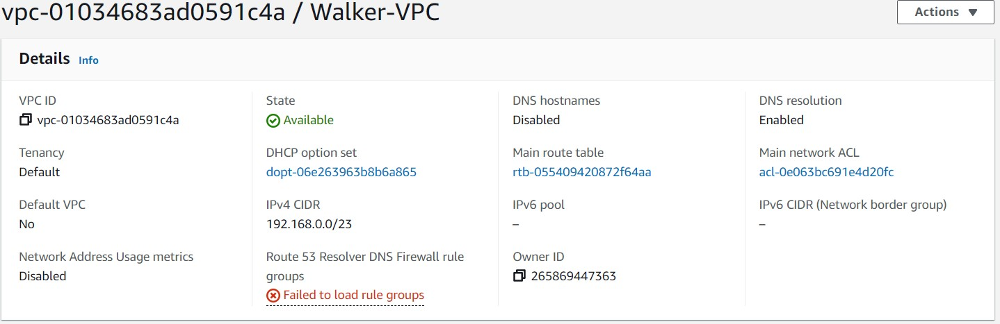
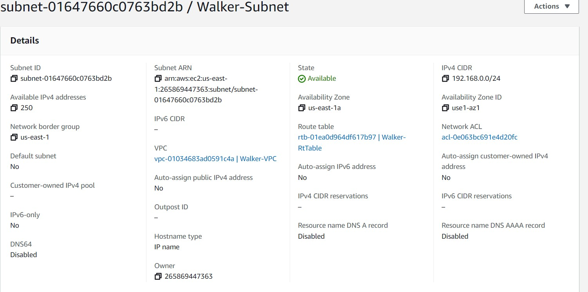
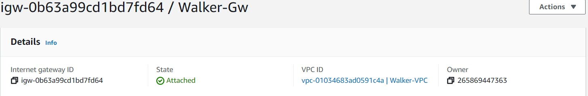
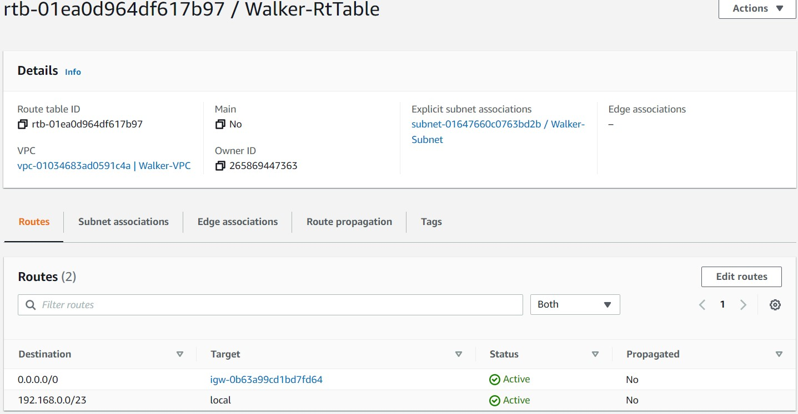
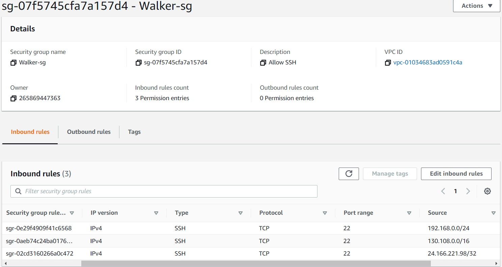
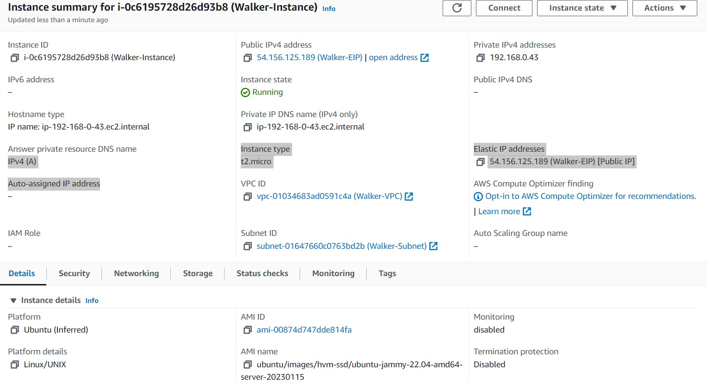
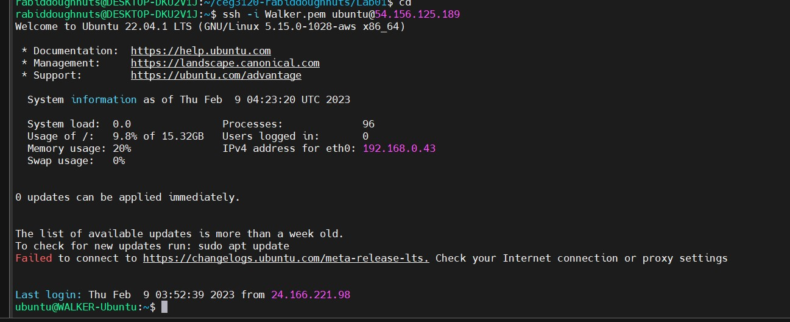

# Project 1

- [Part 1](#Part-1)
- [Part 2](#Part-2)

## Part 1

1. VPC is the private network, that operates as the "cloud" itself.

2. A subnet is a network within the main network that allows you to divide your network into parts.

3. A gateway acts as a router in a computer network. 

4. A route table is a table that determines where data packets are sent.

5. A security group acts as a firewall to control traffic on your network.

## Part 2

1. Ubuntu 22
    -ubuntu
    -t2.micro
    -vockey - this creates a private and public key used as a sort of deadbolt lock and key
2. Click edit netowrk, select the VPC.
3. I did not have a public IPv4 address assigned because we only need the Elastic Ip to SSH in, and the public address gets changed by AWS.
4. Click "Add new volume"
5. At the top of the instance creation menu there is a name field.
6. Under network settings there is a meny to select security group.
7. There is a tab in the EC2 menu for elastic IPs, click the "Allocate EIP" button to create, and then "Actions" button there is an option to assign it to an instance.
8. 
9. `sudo hostnamectl set-hostname WALKER-Ubuntu`

