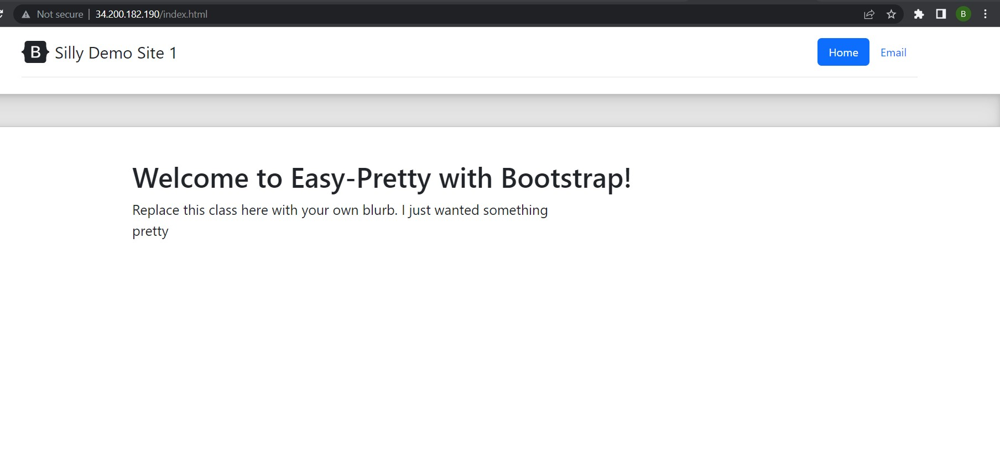
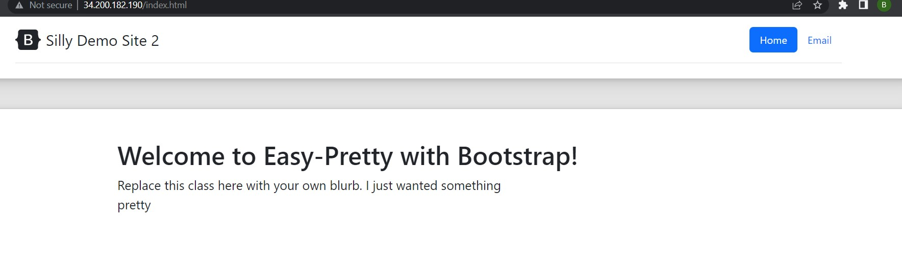
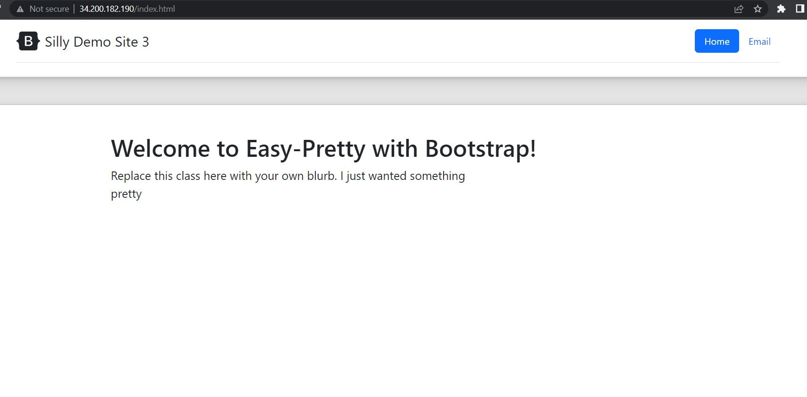

# Project 3

- [Part 1](#Part-1)
- [Part 2](#Part-2)

## Part 1

Turned in layout on time in dropbox and github, though name of layout is incorrect, I missed that step and dont want to go back and change it now, for fear of the late edit making it seem like I worked on it late.

## Part 2

1. The goal of this project is to demonstrate the creation of three hosts for a webpage on aws, with a proxy set up for load balancing across the pages. For this          demonstration each page will be slightly different so you can tell you are connecting to different hosts. This is created by using loading a template with all the      necesary resources into aws. We are creating the same resources as project one and two, but instead of only one public instance, we are creating one public instance    that is used to route traffic to three more private instances.

2. Set up `.ssh/config` on proxy so that I can ssh into the webserv instances easier. I can ssh in with the ssh -i cert.pem ip@user, which gets shortened to ssh name  
   with the .ssh/config, which I shorten with an alias, so I just type w1, w2, or w3 to connect to each webserv instance.

3. The file modified is the haproxy config file, located in `/etc/haproxy/haproxy.cfg`. I set the bind port for the server on the frontend part of the config, and        default backend. For backend I set balance as `leastconn`, default-server as `check maxconn 20` and then listed the servers ips and ports. The command to restart is    `sudo systemctl restart haproxy` and  the websites I used for the setup info was just the two provided.
4. - The files modified were the index.html from the tar file provided, and that whole file was placed in /var/www/html.
   - I set nothing on apache other than the install from the yaml file, and running an updating script on each server and the proxy.
   - Site files were located in /var/www/html because that is where apache serves from according to their default web page.
   - `sudo systemctl restart apache2.service`
   - I just tried things and looked at the default webpage from the servers.  
5. Screenshots below of each connection, all I had to do was refresh to cycle through.

